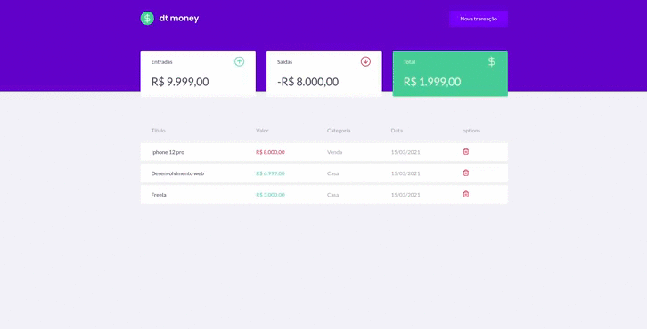

# Dt Money

 * Projeto desenvolvido pela rockseat. A ideia é desenvolver um site de transações com ReactJs junto com o template do figma disponibilizado pela empresa.

 

# 🖥 Tecnologias utilizadas no projeto

 ✅ Polished - Animações 

 ✅ Styled Components - CSS

 ✅ Axios - Cliente Http

 ✅ Miragejs - Fake Api

 

# 🧑‍💻 Densenvolvimento das telas

✔ Pagina Inicial

✔ Criaçao de uma nova transação

✔ Criaçao de Modal

 

# Instalação

~~~html
# Copie e cole no seu terminal 

$ git clone https://github.com/OttoSouza/ignite_dtmoney.git
~~~

~~~html
# Acesse a pasta
$ cd ignite_dtmoney

# Instale as dependencias necessarias para iniciar a aplicação.
# Execute o projeto com: $ yarn start

# Acessa pelo  browser 
$ https://localhost:3000
~~~

 

# Acessar: https://worltrip.vercel.app/

